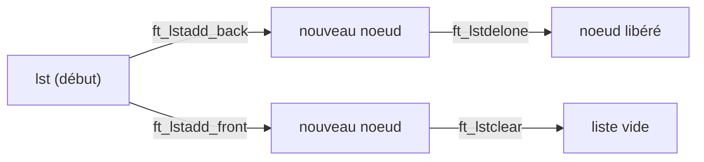

  

  

  

  
  
  

# Documentation de la Libft : Fonctions, Structures et Utilisation

La **Libft** est une bibliothèque C personnelle, souvent réalisée dans le cadre du cursus 42, qui réimplemente de nombreuses fonctions standards : gestion de mémoire, de chaînes de caractères et de listes chaînées.

---

## Makefile : Compilation de la bibliothèque

Le **Makefile** permet de compiler, nettoyer et générer la bibliothèque sous forme d'archive statique (`libft.a`).

Fonctions principales :
- `all` : compile la bibliothèque de base.
- `bonus` : ajoute les fonctions bonus (listes chaînées).
- `clean`/`fclean` : supprime les fichiers objets et la librairie.
- `re` : recompile tout.

---

## Fonctions de caractères et chaînes

### Fonctions de test de caractères

| Nom         | Prototype                        | Description                                  |
|-------------|----------------------------------|----------------------------------------------|
| ft_isalpha  | `int ft_isalpha(int c)`          | Teste si c est une lettre (A-Z, a-z)         |
| ft_isdigit  | `int ft_isdigit(int c)`          | Teste si c est un chiffre (0-9)              |
| ft_isalnum  | `int ft_isalnum(int c)`          | Lettre ou chiffre                            |
| ft_isascii  | `int ft_isascii(int c)`          | Code ASCII standard (0-127)                  |
| ft_isprint  | `int ft_isprint(int c)`          | Caractère imprimable (32-126)                |

---

### Conversion et utilitaires

- **ft_atoi** : Convertit une chaîne en entier (`int ft_atoi(const char *nptr);`)
- **ft_itoa** : Convertit un entier en chaîne (`char *ft_itoa(int n);`)
- **ft_tolower / ft_toupper** : Convertit un caractère vers minuscule/majuscule.

---

### Fonctions de manipulation de chaînes

| Nom             | Prototype                                               | Description                                           |
|-----------------|--------------------------------------------------------|-------------------------------------------------------|
| ft_strlen       | `size_t ft_strlen(const char *s)`                      | Longueur d'une chaîne                                 |
| ft_strdup       | `char *ft_strdup(const char *s)`                       | Duplique une chaîne                                   |
| ft_strchr       | `char *ft_strchr(const char *s, int c)`                | Cherche la première occurrence d’un caractère         |
| ft_strrchr      | `char *ft_strrchr(const char *s, int c)`               | Cherche la dernière occurrence                        |
| ft_strncmp      | `int ft_strncmp(const char *s1, const char *s2, size_t n)` | Compare n caractères de deux chaînes              |
| ft_strnstr      | `char *ft_strnstr(const char *s1, const char *s2, size_t len)` | Cherche une sous-chaîne dans une autre chaîne  |
| ft_strlcpy      | `size_t ft_strlcpy(char *dest, const char *src, size_t size)` | Copie avec taille max                           |
| ft_strlcat      | `size_t ft_strlcat(char *dest, const char *src, size_t size)` | Concatène avec taille max                      |
| ft_strjoin      | `char *ft_strjoin(const char *s1, const char *s2)`     | Concatène deux chaînes                              |
| ft_substr       | `char *ft_substr(const char *s, unsigned int start, size_t len)` | Extrait une sous-chaîne                   |
| ft_strtrim      | `char *ft_strtrim(const char *s1, const char *set)`    | Coupe les caractères d’un set début/fin             |
| ft_split        | `char **ft_split(const char *s, char c)`               | Coupe une chaîne selon un séparateur                |
| ft_strmapi      | `char *ft_strmapi(const char *s, char (*f)(unsigned int, char))` | Mappe chaque caractère                  |
| ft_striteri     | `void ft_striteri(char *s, void (*f)(unsigned int, char*))`     | Itère sur chaque caractère (modifie sur place) |

---

#### Exemple de diagramme : Cycle de vie d'une chaîne avec ft_strjoin et ft_strtrim

---

## Fonctions d'affichage sur File Descriptor

Permet d'écrire sur n'importe quel descripteur de fichier (console, fichier, etc).

| Nom             | Prototype                                      | Description                        |
|-----------------|------------------------------------------------|------------------------------------|
| ft_putchar_fd   | `void ft_putchar_fd(char c, int fd)`           | Affiche un caractère               |
| ft_putstr_fd    | `void ft_putstr_fd(char *s, int fd)`           | Affiche une chaîne                 |
| ft_putendl_fd   | `void ft_putendl_fd(char *s, int fd)`          | Affiche une chaîne suivie d’un '\n'|
| ft_putnbr_fd    | `void ft_putnbr_fd(int n, int fd)`             | Affiche un entier                  |

---

## Fonctions de gestion de listes chaînées (Bonus)

### Fonctions principales

| Nom                    | Prototype                                                                      | Description                         |
|------------------------|--------------------------------------------------------------------------------|-------------------------------------|
| ft_lstnew              | `t_list *ft_lstnew(void *content);`                                            | Crée un nouvel élément              |
| ft_lstadd_front        | `void ft_lstadd_front(t_list **lst, t_list *new);`                             | Ajoute au début                     |
| ft_lstadd_back         | `void ft_lstadd_back(t_list **lst, t_list *new);`                              | Ajoute à la fin                     |
| ft_lstsize             | `int ft_lstsize(t_list *lst);`                                                 | Taille de la liste                  |
| ft_lstlast             | `t_list *ft_lstlast(t_list *lst);`                                             | Dernier élément                     |
| ft_lstdelone           | `void ft_lstdelone(t_list *lst, void (*del)(void *));`                         | Supprime un élément                 |
| ft_lstclear            | `void ft_lstclear(t_list **lst, void (*del)(void *));`                         | Supprime et libère toute la liste   |
| ft_lstiter             | `void ft_lstiter(t_list *lst, void (*f)(void *));`                             | Applique une fonction à chaque node |
| ft_lstmap              | `t_list *ft_lstmap(t_list *lst, void *(*f)(void *), void (*del)(void *));`     | Crée une nouvelle liste avec f      |

---

#### Diagramme : Ajout et suppression dans une liste chaînée

---

## Table récapitulative rapide

| Fichier          | Fonction principale                            | Rôle                                          |
|------------------|-----------------------------------------------|-----------------------------------------------|
| ft_atoi.c        | ft_atoi                                       | Conversion chaîne → int                       |
| ft_bzero.c       | ft_bzero                                      | Mise à zéro mémoire                           |
| ft_calloc.c      | ft_calloc                                     | Allocation + zéro                             |
| ft_isalnum.c     | ft_isalnum                                    | Test alphanumérique                           |
| ft_isalpha.c     | ft_isalpha                                    | Test lettre                                   |
| ft_isascii.c     | ft_isascii                                    | Test ASCII                                    |
| ft_isdigit.c     | ft_isdigit                                    | Test chiffre                                  |
| ft_isprint.c     | ft_isprint                                    | Test imprimable                               |
| ft_itoa.c        | ft_itoa                                       | Conversion int → chaîne                       |
| ft_memchr.c      | ft_memchr                                     | Recherche octet en mémoire                    |
| ft_memcmp.c      | ft_memcmp                                     | Compare mémoire                               |
| ft_memcpy.c      | ft_memcpy                                     | Copie mémoire                                 |
| ft_memmove.c     | ft_memmove                                    | Copie mémoire (zones recouvrantes)            |
| ft_memset.c      | ft_memset                                     | Remplit mémoire                               |
| ft_putchar_fd.c  | ft_putchar_fd                                 | Affiche caractère sur fd                      |
| ft_putendl_fd.c  | ft_putendl_fd                                 | Affiche chaîne + '\n' sur fd                  |
| ft_putnbr_fd.c   | ft_putnbr_fd                                  | Affiche int sur fd                            |
| ft_putstr_fd.c   | ft_putstr_fd                                  | Affiche chaîne sur fd                         |
| ft_split.c       | ft_split                                      | Découpe chaîne (séparateur)                   |
| ft_strchr.c      | ft_strchr                                     | Cherche caractère (première occurrence)       |
| ft_strdup.c      | ft_strdup                                     | Duplique chaîne                               |
| ft_striteri.c    | ft_striteri                                    | Applique fonction sur chaque caractère        |
| ft_strjoin.c     | ft_strjoin                                    | Concatène deux chaînes                        |
| ft_strlcat.c     | ft_strlcat                                    | Concatène avec taille max                     |
| ft_strlcpy.c     | ft_strlcpy                                    | Copie avec taille max                         |
| ft_strlen.c      | ft_strlen                                     | Longueur chaîne                               |
| ft_strmapi.c     | ft_strmapi                                    | Mappe chaque caractère, retourne nouvelle chaîne |
| ft_strncmp.c     | ft_strncmp                                    | Compare n caractères                          |
| ft_strnstr.c     | ft_strnstr                                    | Cherche sous-chaîne dans une chaîne           |
| ft_strrchr.c     | ft_strrchr                                    | Cherche dernière occurrence                   |
| ft_strtrim.c     | ft_strtrim                                    | Coupe caractères début/fin                    |
| ft_substr.c      | ft_substr                                     | Extrait sous-chaîne                           |
| ft_tolower.c     | ft_tolower                                    | Minuscule                                     |
| ft_toupper.c     | ft_toupper                                    | Majuscule                                     |
